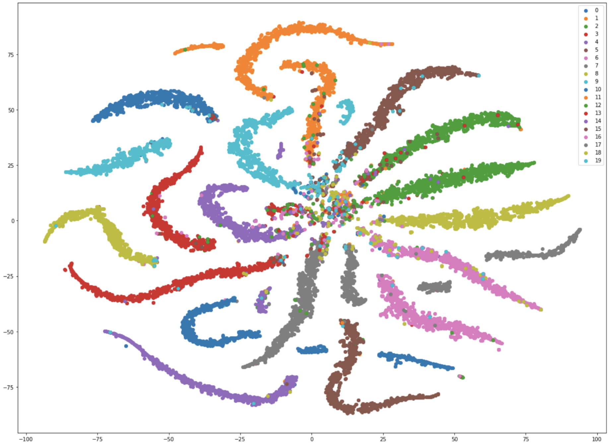
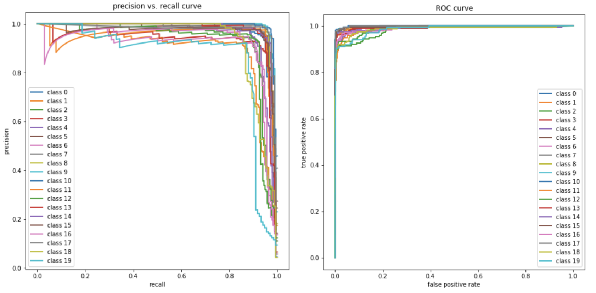
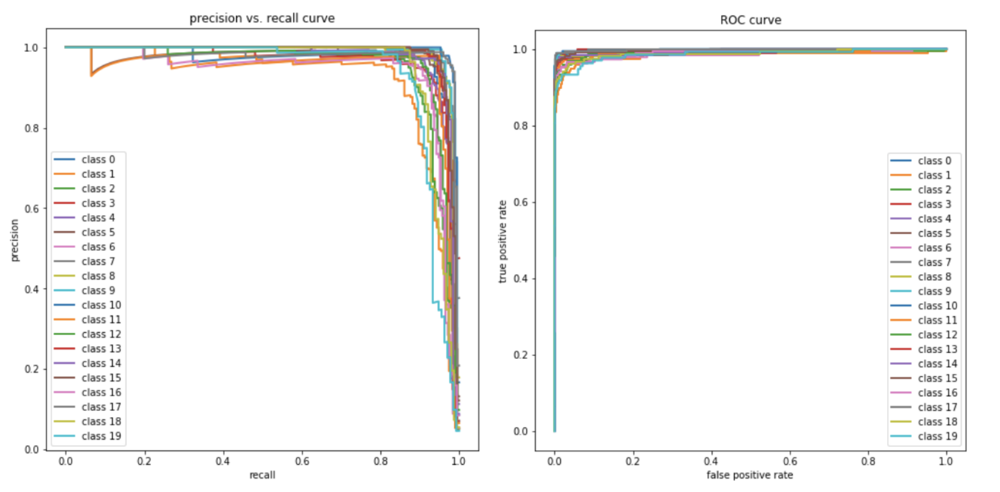

# Project for Machine Learning classes at AGH UST

Evaluation of MLP and AdaBoost classifiers on TNG-like dataset.

## Data exploration performed with t-SNE.

## Precision vs Recall curve, ROC curve

### MLP

### AdaBoost

Full report written in Polish.